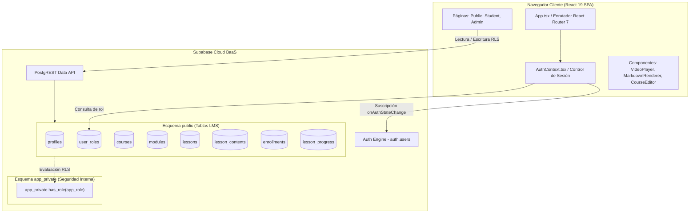
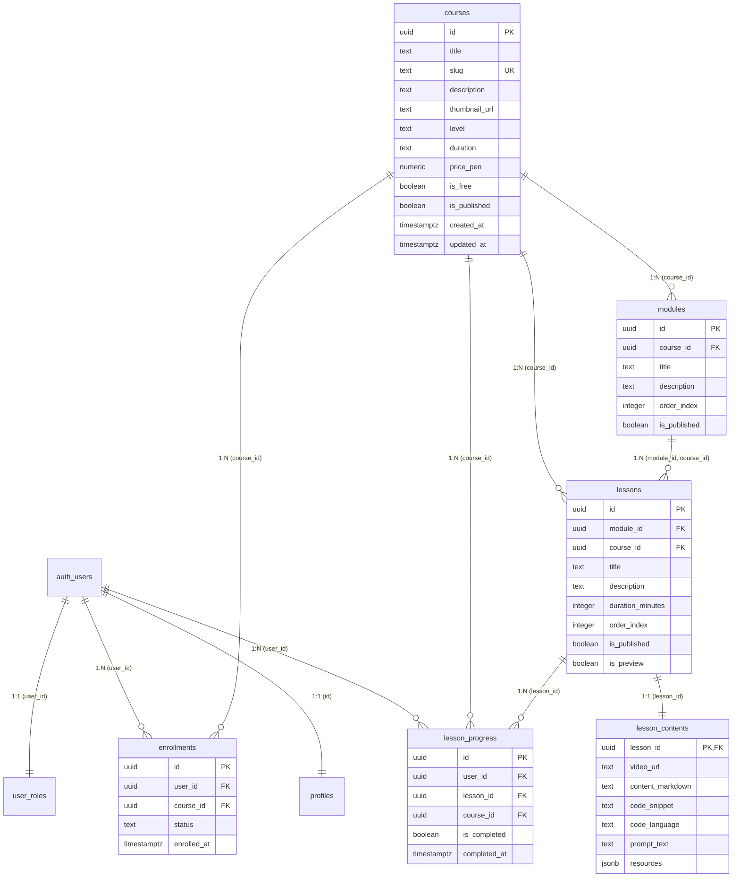
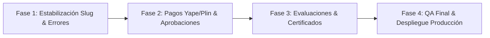

# VEX ACADEMY — Auditoría de Arquitectura, Reutilización y Mapa de Código

> **Documento de Referencia Técnica y Arquitectura de Software**  
> **Proyecto:** VEX ACADEMY  
> **Ubicación:** `C:\Proyectos\Academia`  
> **Fecha de Auditoría:** 7 de Octubre de 2026  
> **Objetivo:** Documentar exhaustivamente la estructura, procedencia, modelo de datos, flujos operacionales y recursos reutilizables para guiar a asistentes de IA y desarrolladores en la continuidad del proyecto.

---

## 1. Resumen Ejecutivo

**VEX ACADEMY** es una plataforma educativa de gestión del aprendizaje (**LMS - Learning Management System**) enfocada en formación tecnológica (programación, desarrollo de aplicaciones e inteligencia artificial). La aplicación está desarrollada como una Single Page Application (SPA) moderna con **React 19**, **TypeScript 6**, **Vite 8** y conectada a la infraestructura BaaS de **Supabase Cloud** (autenticación, PostgreSQL y Row Level Security).

### Estado Actual del Proyecto (Sprint 1 MVP)
El proyecto cuenta con un núcleo funcional completo y operativo para la primera fase de lanzamiento:
1. **Sistema de Autenticación y Control de Roles:** Registro con confirmación por correo, inicio de sesión y asignación estricta de roles (`student` y `admin`) aislados en esquemas de base de datos protegidos.
2. **Catálogo de Cursos Públicos:** Visualización, filtrado por nivel, precio y búsqueda por texto.
3. **Página de Detalle del Curso:** Temario interactivo por módulos y lecciones, cálculo de progreso y llamado a la acción contextual según el estado de matrícula.
4. **Reproductor Educativo de Lecciones:** Integración de video (YouTube, Vimeo, MP4), guías en Markdown, bloques interactivos de código y prompts copiables con un clic, y recursos descargables.
5. **Panel del Estudiante (Campus Virtual):** Métricas consolidadas (cursos inscritos, lecciones superadas, cursos completados) y accesos directos al progreso.
6. **Panel de Administración:** Gestión integral de cursos, edición de metadatos, estructuración de módulos y lecciones, control de precios en Soles (PEN) y alternancia de publicación/borrador.

### Diagnóstico de Madurez para el Lanzamiento
El estado técnico actual alcanza aproximadamente un **85% de cobertura requerida para el MVP**. Las matrículas en cursos gratuitos y el seguimiento del aprendizaje funcionan de forma nativa e inmediata contra Supabase Cloud. Para la monetización con pagos locales (Yape/Plin), el sistema cuenta con la estructura lista en UI y base de datos, requiriendo únicamente la integración del flujo de subida de comprobantes y aprobación manual (aprovechable desde los repositorios de referencia).

---

## 2. Mapa de Carpetas y Archivos Importantes

Estructura real del código fuente de VEX ACADEMY en `C:\Proyectos\Academia`:

```
c:\Proyectos\Academia\
├── .env.example                         # Plantilla de variables de entorno
├── .env.local                           # Configuración local de Supabase URL y Anon Key
├── .gitignore                           # Exclusiones de control de versiones
├── .oxlintrc.json                       # Configuración del linter ultra-rápido Oxlint
├── index.html                           # HTML base de la SPA
├── package.json                         # Dependencias y scripts del proyecto
├── tsconfig.json                        # Configuración principal de TypeScript
├── tsconfig.app.json                    # Configuración de TS para la aplicación React
├── tsconfig.node.json                   # Configuración de TS para herramientas Node/Vite
├── vite.config.ts                       # Configuración del empaquetador Vite
├── docs/
│   └── Arquitectura.md                  # Este documento (Informe técnico de auditoría)
├── references/                          # Repositorios locales de referencia analizados
│   ├── eduflow/                         # Referencia EduFlow (LMS Landing & Course Core)
│   ├── lms-front/                       # Referencia LMS Front (Next.js & Manual Payments)
│   ├── road-academy/                    # Referencia Road Academy (Gamificación y UI LMS)
│   └── teachrepo/                       # Referencia TeachRepo (Prompts, Markdown & Quizzes)
├── src/                                 # Código fuente de VEX ACADEMY
│   ├── main.tsx                         # Punto de entrada de React 19 y montaje en DOM
│   ├── App.tsx                          # Enrutador principal y estructura de rutas (React Router 7)
│   ├── index.css                        # Variables CSS globales, utilidades de diseño y componentes UI
│   ├── assets/                          # Recursos gráficos estáticos
│   ├── config/
│   │   └── brand.ts                     # Configuración centralizada de marca, nombre y paleta CSS
│   ├── context/
│   │   └── AuthContext.tsx              # Proveedor global de autenticación y carga de rol desde DB
│   ├── lib/
│   │   └── supabase.ts                  # Cliente de Supabase inicializado con sesión persistente
│   ├── types/
│   │   ├── index.ts                     # Exportación unificada de tipos TypeScript
│   │   ├── auth.ts                      # Interfaces de usuario, perfiles, roles y AuthContext
│   │   ├── brand.ts                     # Interfaces de branding y colores
│   │   └── lms.ts                       # Modelos de Cursos, Módulos, Lecciones, Matrículas y Progreso
│   ├── components/
│   │   ├── Layout.tsx                   # Shell principal de la app (Header, Nav, Footer, Outlet)
│   │   ├── ProtectedRoute.tsx           # Guardián de rutas autenticadas y verificación de rol admin
│   │   ├── admin/
│   │   │   └── CourseEditor.tsx         # Editor completo de cursos, módulos, lecciones y contenidos
│   │   └── common/
│   │       ├── CopyableBlock.tsx        # Bloque reutilizable para copiar código o prompts de IA
│   │       ├── MarkdownRenderer.tsx     # Renderizador liviano de Markdown con parsing inline y bloques
│   │       └── VideoPlayer.tsx          # Reproductor universal de video (YouTube, Vimeo, HTML5 MP4)
│   └── pages/
│       ├── DashboardPage.tsx            # Enrutador inteligente por rol (Admin -> /admin, Student -> /student)
│       ├── HomePage.tsx                 # Página de bienvenida e inicio de VEX ACADEMY
│       ├── NotFoundPage.tsx             # Pantalla de error 404 para rutas no encontradas
│       ├── admin/
│       │   └── AdminPage.tsx            # Panel administrativo central con tabla de cursos y KPIs
│       ├── auth/
│       │   ├── ConfirmPage.tsx          # Confirmación de correo electrónico tras registro
│       │   ├── LoginPage.tsx            # Formulario de inicio de sesión con Supabase Auth
│       │   └── SignupPage.tsx           # Formulario de registro con captura de nombre completo
│       ├── courses/
│       │   ├── CourseDetailPage.tsx     # Ficha detallada del curso, temario y llamada a matrícula
│       │   ├── CoursesPage.tsx          # Catálogo público de cursos con barra de filtros y búsqueda
│       │   └── LessonPlayerPage.tsx     # Reproductor educativo con temario lateral y pestañas de contenido
│       └── student/
│           └── StudentPage.tsx          # Panel privado del estudiante con métricas y cursos activos
└── supabase/
    ├── schema.sql                       # Esquema base de Auth, perfiles, user_roles y función has_role
    └── migrations/
        └── 20261007000000_lms_core.sql # Esquema LMS (courses, modules, lessons, contents, enrollments, progress, RLS)
```

---

## 3. Tecnologías y Arquitectura

### 3.1 Stack Tecnológico

| Capa | Tecnología | Versión | Propósito / Función |
| :--- | :--- | :--- | :--- |
| **Frontend Core** | React | `^19.2.8` | Biblioteca de interfaz de usuario basada en componentes. |
| **Lenguaje** | TypeScript | `~6.0.2` | Tipado estático estricto y prevención de errores en desarrollo. |
| **Empaquetador** | Vite | `^8.3.0` | Server de desarrollo HMR instantáneo y build optimizado de producción. |
| **Enrutamiento** | React Router DOM | `^7.18.4` | Navegación SPA con soporte de layouts anidados y componentes `<Outlet />`. |
| **Backend / BaaS** | Supabase Cloud | `^2.117.3` | Autenticación, PostgreSQL gestionado y Row Level Security (RLS). |
| **Iconografía** | Lucide React | `^1.52.0` | Set de iconos SVG modernos y livianos. |
| **Linter** | Oxlint | `^1.81.0` | Herramienta de linter de alto rendimiento basada en Rust. |
| **Estilos** | CSS Moderno Native | Vanilla CSS | Sistema de variables CSS dinámicas, Flexbox, Grid y media queries. |

### 3.2 Patrón de Arquitectura

VEX ACADEMY sigue una **arquitectura cliente-servidor desacoplada (BaaS Single Page Application)**. El cliente de React maneja completamente la renderización, navegación y estados locales, mientras que **Supabase Cloud** actúa como la capa de persistencia y seguridad.



### Principios Clave de Diseño
1. **Aislamiento de Privilegios:** La asignación de roles se realiza en la tabla aislada [public.user_roles](file:///c:/Proyectos/Academia/supabase/schema.sql#L42-L46) (no modificable desde la API del cliente). Las funciones de validación como [app_private.has_role()](file:///c:/Proyectos/Academia/supabase/schema.sql#L125-L138) se ejecutan con `SECURITY DEFINER` en un esquema privado no expuesto a PostgREST.
2. **Defensa en Profundidad RLS:** Las tablas de contenido sensible (como `lesson_contents`) ocultan URLs de video, prompts y código de lecciones privadas mediante políticas RLS que verifican explícitamente si el usuario tiene una matrícula activa (`status = 'active'`) o el rol `admin`.
3. **Carga Reactiva sin Prop-Drilling:** `AuthContext` expone `user`, `role`, `loading` y `roleLoading` de forma global, permitiendo a `ProtectedRoute` tomar decisiones instantáneas de renderizado.

---

## 4. Matriz de Procedencia y Reutilización

> **Clasificación de tipos de reutilización:**  
> **A.** Coincidencia directa de código.  
> **B.** Adaptación cercana de una implementación existente.  
> **C.** Reutilización de un patrón lógico o arquitectónico.  
> **D.** Inspiración visual o de experiencia de usuario.  
> **E.** Implementación propia sin correspondencia identificada.  
> **F.** Origen no verificable.

| Funcionalidad VEX ACADEMY | Archivo Actual VEX ACADEMY | Proyecto de Referencia | Archivo Original de Referencia | Tipo | Evidencia Concreta |
| :--- | :--- | :--- | :--- | :---: | :--- |
| **Cliente Supabase** | [src/lib/supabase.ts](file:///c:/Proyectos/Academia/src/lib/supabase.ts) | EduFlow | `lms-landing/src/lib/supabase.ts` | **A** | Estructura exacta de inicialización con `createClient` e inspección defensiva de variables `VITE_SUPABASE_URL` y `VITE_SUPABASE_ANON_KEY`. |
| **Contexto de Autenticación** | [src/context/AuthContext.tsx](file:///c:/Proyectos/Academia/src/context/AuthContext.tsx) | EduFlow / Road Academy | `eduflow/lms-landing/src/contexts/AuthContext.tsx` / `road-academy/src/hooks/useRoles.ts` | **B** | Estructura de suscriptor `onAuthStateChange`, adaptada para consultar la tabla `user_roles` con `maybeSingle()` y usar `activeUserIdRef` para evitar condiciones de carrera. |
| **Guardián de Rutas** | [src/components/ProtectedRoute.tsx](file:///c:/Proyectos/Academia/src/components/ProtectedRoute.tsx) | EduFlow / Road Academy | `eduflow/lms-landing/src/components/ProtectedRoute.tsx` / `road-academy/src/components/ProtectedRoute.tsx` | **B** | Manejo de estados de carga, redirección con estado `from: location` y renderizado de pantalla de acceso denegado con badge de permisos. |
| **Catálogo de Cursos** | [src/pages/courses/CoursesPage.tsx](file:///c:/Proyectos/Academia/src/pages/courses/CoursesPage.tsx) | EduFlow / Road Academy | `eduflow/lms-landing/src/pages/course/CourseCatalog.tsx` / `road-academy/src/pages/CoursesPublic.tsx` | **B** | Consulta Supabase con joins anidados `courses -> modules -> lessons`, filtrado local en memoria por nivel y precio, y diseño en rejilla (`courses-grid`). |
| **Ficha del Curso** | [src/pages/courses/CourseDetailPage.tsx](file:///c:/Proyectos/Academia/src/pages/courses/CourseDetailPage.tsx) | EduFlow / Road Academy | `eduflow/lms-landing/src/pages/course/CourseDetailPage.tsx` / `road-academy/src/pages/CourseDetail.tsx` | **B** | Acordeón interactivo de módulos, verificación de matrícula previa, llamada a RPC `enroll_in_free_course` y modal informativo de pasarela. |
| **Reproductor de Lecciones** | [src/pages/courses/LessonPlayerPage.tsx](file:///c:/Proyectos/Academia/src/pages/courses/LessonPlayerPage.tsx) | EduFlow / Road Academy | `eduflow/lms-landing/src/pages/course/LessonPlayer.tsx` / `road-academy/src/pages/Lesson.tsx` | **B** | Layout de dos columnas con temario lateral (playlist), pestañas de guías/prompts/código y lógica de guardado en `lesson_progress`. |
| **Reproductor de Video** | [src/components/common/VideoPlayer.tsx](file:///c:/Proyectos/Academia/src/components/common/VideoPlayer.tsx) | Road Academy | `road-academy/src/components/video/VideoPlayer.tsx` | **B** | Lógica de normalización mediante Expresiones Regulares para transformar URLs de YouTube (shorts/embeds), Vimeo e iframe HTML5. |
| **Panel del Estudiante** | [src/pages/student/StudentPage.tsx](file:///c:/Proyectos/Academia/src/pages/student/StudentPage.tsx) | EduFlow / Road Academy | `eduflow/lms-landing/src/pages/student/StudentDashboard.tsx` / `road-academy/src/pages/Dashboard.tsx` | **B** | Tarjetas KPI de resumen, consolidación de lecciones completadas por curso y barra de progreso calculada dinámicamente. |
| **Panel Administrativo** | [src/pages/admin/AdminPage.tsx](file:///c:/Proyectos/Academia/src/pages/admin/AdminPage.tsx) | Road Academy | `road-academy/src/components/admin/AdminCourses.tsx` | **B** | Tabla administrativa de cursos con toggle rápido de publicación (`is_published`), contadores de módulos/lecciones y eliminación en cascada. |
| **Editor de Cursos** | [src/components/admin/CourseEditor.tsx](file:///c:/Proyectos/Academia/src/components/admin/CourseEditor.tsx) | EduFlow / Road Academy | `eduflow/lms-landing/src/pages/instructor/CreateCoursePage.tsx` / `road-academy/src/components/admin/CourseEditor.tsx` | **B** | Formulario multitab (detalles general vs estructura), modales flotantes para módulos/lecciones y edición de contenido protegido `lesson_contents`. |
| **Renderizado Markdown** | [src/components/common/MarkdownRenderer.tsx](file:///c:/Proyectos/Academia/src/components/common/MarkdownRenderer.tsx) | TeachRepo / VEX | `teachrepo/posts/from-markdown-to-paywalled-course.md` | **C** | Parser personalizado liviano línea por línea para encabezados, viñetas, citas y bloques de código sin dependencias pesadas externas. |
| **Bloque Copiable Prompt/Code** | [src/components/common/CopyableBlock.tsx](file:///c:/Proyectos/Academia/src/components/common/CopyableBlock.tsx) | TeachRepo / VEX | `teachrepo/posts/yaml-frontmatter-quizzes.md` | **C/E** | Componente visual especializado para copiar prompts de IA y fragmentos de código con retroalimentación en UI (`navigator.clipboard`). |
| **Configuración de Marca** | [src/config/brand.ts](file:///c:/Proyectos/Academia/src/config/brand.ts) | VEX ACADEMY | Implementación Propia | **E** | Módulo de configuración de la marca VEX ACADEMY que inyecta automáticamente variables CSS `--color-*` en `document.documentElement`. |
| **Esquema de BD y RLS** | [supabase/schema.sql](file:///c:/Proyectos/Academia/supabase/schema.sql) & [20261007000000_lms_core.sql](file:///c:/Proyectos/Academia/supabase/migrations/20261007000000_lms_core.sql) | EduFlow / Road Academy / VEX | `eduflow/supabase/functions` / `road-academy/supabase/migrations` | **C** | Arquitectura SQL refinada con separación de metadatos `lessons` vs contenido protegido `lesson_contents`, y procedimiento atómico `enroll_in_free_course`. |

---

## 5. Flujo de Datos y Operaciones

### 5.1 Registro e Inicio de Sesión
- **Página / Componente:** [LoginPage.tsx](file:///c:/Proyectos/Academia/src/pages/auth/LoginPage.tsx), [SignupPage.tsx](file:///c:/Proyectos/Academia/src/pages/auth/SignupPage.tsx), [ConfirmPage.tsx](file:///c:/Proyectos/Academia/src/pages/auth/ConfirmPage.tsx).
- **Funciones:** `signIn(email, password)`, `signUp(email, password, fullName)` en [AuthContext.tsx](file:///c:/Proyectos/Academia/src/context/AuthContext.tsx#L107-L155).
- **Tabla / RPC Utilizada:** `auth.users` (gestionado por Supabase Auth) y trigger de PostgreSQL [public.handle_new_user()](file:///c:/Proyectos/Academia/supabase/schema.sql#L72-L119).
- **Validaciones y Permisos:** Sanitizado de strings con `.trim()`, longitud mínima de contraseña (6 caracteres), coincidencia de contraseñas.
- **Dependencias:** `supabase.auth.signInWithPassword`, `supabase.auth.signUp`.
- **Estado:** **Efectivamente Implementado y Probado**.

### 5.2 Detección de Administrador o Estudiante
- **Página / Componente:** [AuthContext.tsx](file:///c:/Proyectos/Academia/src/context/AuthContext.tsx), [DashboardPage.tsx](file:///c:/Proyectos/Academia/src/pages/DashboardPage.tsx), [ProtectedRoute.tsx](file:///c:/Proyectos/Academia/src/components/ProtectedRoute.tsx).
- **Funciones:** `fetchUserRole(userId)` en `AuthContext.tsx`.
- **Tabla / RPC Utilizada:** `public.user_roles`.
- **Validaciones y Permisos:** Consulta mediante `.maybeSingle()`. Si el usuario no tiene registro explícito, se asigna `role = null` evitando elevación de privilegios. `DashboardPage` redirige a `/admin` si `role === 'admin'`, o a `/student` por defecto.
- **Dependencias:** `useAuth()`.
- **Estado:** **Efectivamente Implementado y Probado**.

### 5.3 Creación de un Curso
- **Página / Componente:** [AdminPage.tsx](file:///c:/Proyectos/Academia/src/pages/admin/AdminPage.tsx), [CourseEditor.tsx](file:///c:/Proyectos/Academia/src/components/admin/CourseEditor.tsx).
- **Funciones:** `handleSaveCourse()` en `CourseEditor.tsx`.
- **Tabla / RPC Utilizada:** `public.courses`.
- **Validaciones y Permisos:** `app_private.has_role('admin')` exigido por RLS en `courses`. Título y slug requeridos. Validación comercial (`is_free = true` fuerza `price_pen = 0`).
- **Dependencias:** `supabase.from('courses').insert()`.
- **Estado:** **Efectivamente Implementado**.

### 5.4 Creación de Módulos y Lecciones
- **Página / Componente:** [CourseEditor.tsx](file:///c:/Proyectos/Academia/src/components/admin/CourseEditor.tsx).
- **Funciones:** `handleSaveModule()`, `handleSaveLesson()`.
- **Tabla / RPC Utilizada:** `public.modules`, `public.lessons`, `public.lesson_contents` (vía trigger `on_lesson_created` y upsert manual).
- **Validaciones y Permisos:** RLS exige rol `admin`. La lección requiere un `module_id` existente y un `course_id` válido.
- **Dependencias:** Trigger PostgreSQL `handle_new_lesson()`.
- **Estado:** **Efectivamente Implementado**.

### 5.5 Publicación de Cursos
- **Página / Componente:** [AdminPage.tsx](file:///c:/Proyectos/Academia/src/pages/admin/AdminPage.tsx#L82-L100), [CourseEditor.tsx](file:///c:/Proyectos/Academia/src/components/admin/CourseEditor.tsx#L706-L722).
- **Funciones:** `handleTogglePublish(course)`.
- **Tabla / RPC Utilizada:** `public.courses`.
- **Validaciones y Permisos:** Actualización del campo `is_published` a booleano. Permisos RLS restringidos a `admin`.
- **Dependencias:** `supabase.from('courses').update({ is_published })`.
- **Estado:** **Efectivamente Implementado**.

### 5.6 Visualización del Catálogo Público
- **Página / Componente:** [CoursesPage.tsx](file:///c:/Proyectos/Academia/src/pages/courses/CoursesPage.tsx).
- **Funciones:** `loadCourses()` en `useEffect`.
- **Tabla / RPC Utilizada:** `public.courses` con política RLS `courses_select_published` (`is_published = true`).
- **Validaciones y Permisos:** Lectura pública autorizada para roles `anon` y `authenticated`.
- **Dependencias:** `supabase.from('courses').select('*, modules(id, lessons(id))')`.
- **Estado:** **Efectivamente Implementado**.

### 5.7 Matrícula Gratuita
- **Página / Componente:** [CourseDetailPage.tsx](file:///c:/Proyectos/Academia/src/pages/courses/CourseDetailPage.tsx#L145-L184).
- **Funciones:** `handleEnrollFree()`.
- **Tabla / RPC Utilizada:** Función RPC `public.enroll_in_free_course(p_course_id)`.
- **Validaciones y Permisos:** La función verifica en la base de datos que el usuario esté autenticado (`auth.uid() IS NOT NULL`), que el curso esté publicado (`is_published = true`) y que sea gratuito (`is_free = true`).
- **Dependencias:** `supabase.rpc('enroll_in_free_course', { p_course_id })`.
- **Estado:** **Efectivamente Implementado y Probado**.

### 5.8 Acceso al Reproductor
- **Página / Componente:** [LessonPlayerPage.tsx](file:///c:/Proyectos/Academia/src/pages/courses/LessonPlayerPage.tsx).
- **Funciones:** `loadPlayerData()` en `useEffect`.
- **Tabla / RPC Utilizada:** `public.courses`, `public.modules`, `public.lessons`, `public.lesson_contents`, `public.enrollments`.
- **Validaciones y Permisos:** RLS en `lesson_contents` valida si la lección es `is_preview = true`, si el usuario tiene una fila en `enrollments` con `status = 'active'`, o si es `admin`. De lo contrario, retorna nulo y muestra la pantalla de contenido restringido.
- **Dependencias:** Políticas RLS `lesson_contents_select_student` y `lesson_contents_select_preview`.
- **Estado:** **Efectivamente Implementado**.

### 5.9 Actualización del Progreso
- **Página / Componente:** [LessonPlayerPage.tsx](file:///c:/Proyectos/Academia/src/pages/courses/LessonPlayerPage.tsx#L181-L228).
- **Funciones:** `handleToggleComplete()`.
- **Tabla / RPC Utilizada:** `public.lesson_progress`.
- **Validaciones y Permisos:** RLS valida que el `user_id` coincida con `auth.uid()` y que exista una matrícula activa en el curso correspondiente.
- **Dependencias:** `supabase.from('lesson_progress').upsert()` o `.delete()`.
- **Estado:** **Efectivamente Implementado**.

---

## 6. Modelo de Base de Datos y Seguridad

### 6.1 Diagrama Entidad-Relación (ERD)



### 6.2 Políticas de Row Level Security (RLS) Destacadas

1. **Protección de Contenido Sensible (`lesson_contents`):**
   - **Previsuación:** [lesson_contents_select_preview](file:///c:/Proyectos/Academia/supabase/migrations/20261007000000_lms_core.sql#L367-L381): Permite lectura anónima y autenticada únicamente si `lessons.is_preview = true` y el curso está publicado.
   - **Estudiantes:** [lesson_contents_select_student](file:///c:/Proyectos/Academia/supabase/migrations/20261007000000_lms_core.sql#L383-L402): Permite lectura a usuarios autenticados si existe un registro activo en `enrollments` (`status = 'active'`) para ese curso.
   - **Administrador:** [lesson_contents_admin_all](file:///c:/Proyectos/Academia/supabase/migrations/20261007000000_lms_core.sql#L404-L410): Control total si `app_private.has_role('admin')` evalúa a verdadero.

2. **Matrículas Seguras (`enrollments`):**
   - Los estudiantes solo pueden consultar sus propias matrículas (`user_id = auth.uid()`).
   - Solo pueden insertar matrículas directamente si el curso es explícitamente `is_free = true` e `is_published = true`. Para cursos de pago, la inserción directa por cliente está bloqueada en RLS, requiriendo invocación mediante función administrative o pago validado.

---

## 7. Recursos Aprovechables para el Lanzamiento

Analizamos los cuatro repositorios locales en `references/` para identificar funcionalidades listas para ser migradas a VEX ACADEMY:

| Funcionalidad MVP | Repositorio y Archivo Concreto | Funcionalidad Existente | Compatibilidad | Adaptación Necesaria | Complejidad | Riesgos Técnicos / Seguridad |
| :--- | :--- | :--- | :--- | :--- | :---: | :--- |
| **Solicitudes de compra y comprobantes Yape/Plin** | `references/lms-front` -> `tests/unit/manual-payment-report.test.ts` & `manual-payment-method.test.ts` | Sistema completo de envío de comprobante de pago manual (Yape/Plin) con número de operación y captura de imagen de vástago/ticket. | **Alta** | Crear la tabla `manual_payment_requests` en Supabase y componente modal de subida de comprobante en React 19. | **Baja** | Validar que el archivo subido al storage sea una imagen válida (MIME type check) para evitar abuso. |
| **Aprobación manual de pagos** | `references/lms-front` -> `tests/unit/reject-manual-payment.test.ts` | Endpoint y flujo de revisión administrativa para aprobar/rechazar pagos pendientes y activar matrículas. | **Alta** | Crear vista de tabla de pagos pendientes en [AdminPage.tsx](file:///c:/Proyectos/Academia/src/pages/admin/AdminPage.tsx) con botones de "Aprobar" (inserta en `enrollments`) y "Rechazar". | **Baja** | Asegurar que la aprobación ejecute `SECURITY DEFINER` o use RLS de admin para evitar suplantaciones. |
| **Administración de matrículas** | `references/road-academy` -> `src/components/admin/AdminUsers.tsx` | Gestión de usuarios, asignación de matrículas manuales por correo y revocación de accesos. | **Alta** | Extraer el panel de asignación manual de matrículas e integrarlo en la interfaz de administración. | **Baja** | Verificar que no interfiera con las matrículas activas previas. |
| **Gamificación y Streaks (Estudiante)** | `references/road-academy` -> `src/components/engagement/DailyStreakCard.tsx` & `src/hooks/useDailyStreak.ts` | Contador de racha diaria de estudio, medallas de logros y barra de nivel de progreso. | **Media** | Adaptar los tipos de estado a las lecciones completadas en VEX ACADEMY. | **Media** | Ninguno significativo. Incrementa la retención del estudiante. |
| **Cuestionarios y Evaluaciones** | `references/teachrepo` -> `posts/yaml-frontmatter-quizzes.md` | Estructura de quizzes embebidos en Markdown mediante bloques YAML Frontmatter. | **Alta** | Extender [MarkdownRenderer.tsx](file:///c:/Proyectos/Academia/src/components/common/MarkdownRenderer.tsx) para interpretar el formato de preguntas de opción múltiple. | **Media** | Ninguno. Permite agregar quizzes dinámicos en las lecciones sin alterar el esquema SQL. |
| **Emisión y Verificación de Certificados** | `references/lms-front` -> `tests/unit/pdf-generator-colors.test.ts` | Generador de certificados PDF al completar el 100% del curso con código hash de verificación. | **Media** | Portar la función de generación HTML/PDF o renderizado en Canvas descargable al completar el curso. | **Media** | Ninguno. Excelente valor percibido para la academia. |

### Análisis Legal de Licencias (`LICENSE`)
- `references/eduflow/LICENSE`: **Licencia MIT** (Libre copia, modificación y uso comercial).
- `references/lms-front/LICENSE`: **Licencia MIT** (Libre copia, modificación y uso comercial).
- `references/teachrepo/LICENSE`: **Licencia MIT** (Libre copia, modificación y uso comercial).
- `references/road-academy/package.json`: Especifica `"license": "MIT"`.

> [!NOTE]
> **Conclusión Legal:** Todos los repositorios de referencia están bajo **Licencia MIT**. El código, los patrones y las estructuras de estas referencias pueden ser reutilizados, adaptados e integrados libremente en VEX ACADEMY.

---

## 8. Diagnóstico del Proyecto, Problemas y Riesgos

### 8.1 Diagnóstico del Error `duplicate key value violates unique constraint "courses_slug_key"`

#### Causa Raíz Demostrable
El error ocurre durante la creación o actualización de cursos en [CourseEditor.tsx](file:///c:/Proyectos/Academia/src/components/admin/CourseEditor.tsx).
En las líneas 166-179 de `CourseEditor.tsx`, la función de generación de slug opera de forma puramente determinista a partir del título:

```typescript
  const handleTitleChange = (val: string) => {
    setCourseForm((prev) => {
      const updated = { ...prev, title: val }
      if (!isEditing || !prev.slug) {
        updated.slug = val
          .toLowerCase()
          .trim()
          .replace(/[^\w\s-]/g, '')
          .replace(/[\s_-]+/g, '-')
          .replace(/^-+|-+$/g, '')
      }
      return updated
    })
  }
```

#### Mecanismo del Fallo
1. Si un administrador intenta crear un curso con un título idéntico o muy similar a uno existente (ejemplo: *"Desarrollo Web con React"* y más adelante otro *"Desarrollo Web con React"*), la función asignará el slug `desarrollo-web-con-react`.
2. Al ejecutar la instrucción `supabase.from('courses').insert(payload)` en la línea 221, PostgreSQL intenta insertar la fila.
3. Como la columna `slug` tiene la restricción `UNIQUE NOT NULL` (definida en línea 14 de `20261007000000_lms_core.sql`), PostgreSQL rechaza la transacción arrojando: `duplicate key value violates unique constraint "courses_slug_key"`.
4. El editor no verifica previamente en la base de datos si el slug ya está en uso, ni añade un sufijo aleatorio/numérico único (ej. `desarrollo-web-con-react-2` o sufijo nanoid/timestamp).

### 8.2 Otros Riesgos y Puntos Incompletos Identificados

1. **Modal Informativo de Pago:** En [CourseDetailPage.tsx](file:///c:/Proyectos/Academia/src/pages/courses/CourseDetailPage.tsx#L476-L541), el modal de inscripción para cursos de pago muestra un aviso estático y redirige a WhatsApp en lugar de permitir adjuntar el comprobante de Yape/Plin.
2. **URLs de Miniaturas Externas:** En la creación de cursos, la imagen se especifica únicamente mediante una URL de texto (`thumbnail_url`), sin un botón directo de carga de archivos hacia Supabase Storage.
3. **Ausencia de Pruebas Automatizadas:** El proyecto principal no tiene configurado un ejecutor de pruebas (como Vitest), aunque los repositorios de referencia en `references/lms-front` cuentan con una amplia suite de tests utilizable como especificación.

---

## 9. Roadmap Técnico Recomendado para Lanzar el MVP



### Fase 1: Corrección de Slug y Estabilización (Día 1)
- [ ] Implementar generador de slug con resolución de colisiones (añadir sufijos numéricos o hash único en `CourseEditor.tsx` al detectar duplicados).
- [ ] Agregar validación defensiva en UI para mostrar mensajes claros al usuario si el slug está tomado.

### Fase 2: Módulo de Pagos Locales Yape/Plin (Días 2 - 3)
- [ ] Crear la tabla `public.payment_requests` para almacenar solicitudes de pago con comprobante adjunto.
- [ ] Crear un bucket de almacenamiento en Supabase (`payment-receipts`).
- [ ] Reemplazar el modal informativo de [CourseDetailPage.tsx](file:///c:/Proyectos/Academia/src/pages/courses/CourseDetailPage.tsx) por el formulario de subida de comprobantes.
- [ ] Implementar la pestaña "Pagos Pendientes" en [AdminPage.tsx](file:///c:/Proyectos/Academia/src/pages/admin/AdminPage.tsx) para aprobación/rechazo manual en 1 clic.

### Fase 3: Evaluaciones y Certificados (Días 4 - 5)
- [ ] Integrar el soporte de Quizzes YAML en Markdown desde TeachRepo.
- [ ] Habilitar la vista de generación y descarga de Certificado al alcanzar el 100% de progreso en el curso.

### Fase 4: Despliegue a Producción (Día 6)
- [ ] Configurar variables de entorno de producción en Vercel/Netlify.
- [ ] Ejecutar prueba end-to-end de registro, pago manual, aprobación, lección y progreso.

---

## 10. Archivos Específicos que Debería Consultar Otro Asistente de IA

Para cualquier trabajo de desarrollo posterior, otro asistente de IA o desarrollador debe consultar de forma prioritaria los siguientes archivos:

1. [src/App.tsx](file:///c:/Proyectos/Academia/src/App.tsx): Mapa global de rutas públicas y protegidas.
2. [src/context/AuthContext.tsx](file:///c:/Proyectos/Academia/src/context/AuthContext.tsx): Lógica de autenticación, sesión y roles (`user`, `role`).
3. [src/types/lms.ts](file:///c:/Proyectos/Academia/src/types/lms.ts): Definición exacta de modelos TypeScript (Course, Module, Lesson, Enrollment, Progress).
4. [src/components/admin/CourseEditor.tsx](file:///c:/Proyectos/Academia/src/components/admin/CourseEditor.tsx): Formulario administrativo principal de creación/edición de contenidos y lógica de slugs (Líneas 166-179 y 200-240).
5. [src/pages/courses/CourseDetailPage.tsx](file:///c:/Proyectos/Academia/src/pages/courses/CourseDetailPage.tsx): Ficha del curso y flujo de inscripción/matrícula (Líneas 145-184 y 476-541).
6. [src/pages/courses/LessonPlayerPage.tsx](file:///c:/Proyectos/Academia/src/pages/courses/LessonPlayerPage.tsx): Reproductor de lecciones, temario y actualización de progreso.
7. [supabase/schema.sql](file:///c:/Proyectos/Academia/supabase/schema.sql): Esquema base de perfiles, roles y función `app_private.has_role()`.
8. [supabase/migrations/20261007000000_lms_core.sql](file:///c:/Proyectos/Academia/supabase/migrations/20261007000000_lms_core.sql): Tablas del núcleo LMS, función `enroll_in_free_course` y políticas RLS.

